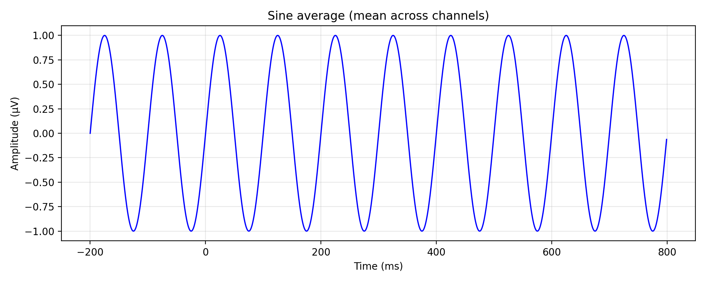
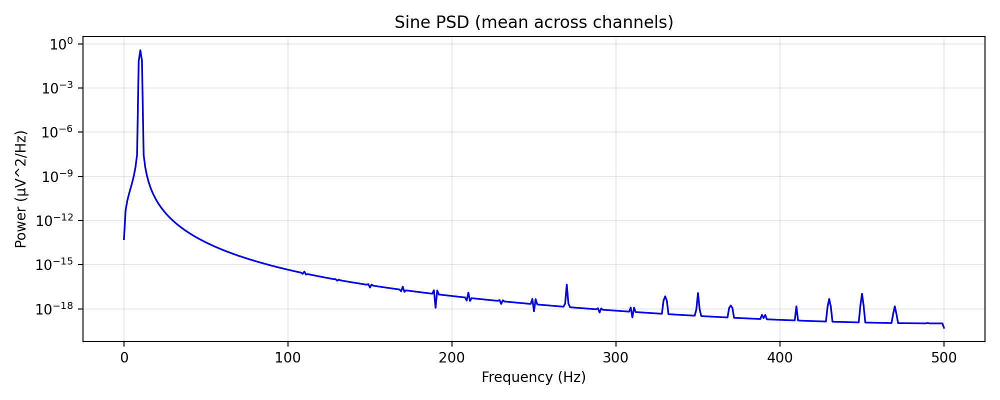

# save_sine_avg_psd.py

Back to [experiments overview](README.md).

## Purpose
Generate average ERP and PSD summaries from a synthetic sine dataset, then save plots and numeric exports (PNG, PDF, NPZ, and BIN) for downstream comparison with EEGLAB.

## Inputs and data sources
- Required: a synthetic BIN dataset directory containing:
  - `params.json` (optional but recommended)
  - `ContinuousSine_continuous.bin` (default data file)
- Optional EEGLAB PSD reference:
  - `EEGlab_psd_dB_continuous.bin` (if present, the script uses this dB PSD for direct parity)

The defaults assume `experiments/synData/ContinuousSine/`.

## What the script does
1. Loads the BIN dataset with `CortiDataset.from_bin`.
2. Reads metadata from `params.json` if available (sampling rate, epoch window, trigger interval, channel count).
3. Determines trigger samples:
   - Uses stim channels if present.
   - Else looks for a channel named "trig" or falls back to channel 1 and detects rising edges.
   - If no trigger channel exists, it creates synthetic triggers at a fixed interval.
4. Extracts channel 0, epochs around triggers using `epoch_window_s`, and computes an average ERP.
5. Computes PSD for channel 0:
   - Uses EEGLAB PSD bin if available (dB converted to linear for plotting).
   - Otherwise runs Welch PSD via SciPy.
6. Saves plots and numeric exports.
7. Mirrors the main BIN exports into `experiments/synData/ContinuousSine/` for MATLAB/EEGLAB parity checks.

## Outputs and plots
Written to `--output-dir` (default `experiments/format_benchmark/results_sine/`):
- `sine_average.png` / `sine_average.pdf`: ERP in milliseconds.
- `sine_psd.png` / `sine_psd.pdf`: PSD in microvolts^2/Hz.
- `sine_avg_psd.npz`: arrays (`time_ms`, `erp`, `freqs`, `psd`).
- `bin/` exports:
  - `CortiPy_erp_average.bin` (interleaved axis + data)
  - `CortiPy_psd_dB.bin` (interleaved axis + data, dB)
  - Concatenated variants for easy MATLAB splitting
- Mirrored copies of the interleaved BINs are written to `experiments/synData/ContinuousSine/`.

## Example outputs (current results)



## How to run
```bash
python experiments/save_sine_avg_psd.py experiments/synData/ContinuousSine
```

## Related experiments
- [plot_sine_bins](README_plot_sine_bins.md) visualizes BIN exports when stored as axis+data.
- [plot_eeglab_sine_bins](README_plot_eeglab_sine_bins.md) visualizes EEGLAB reference BINs.
- [compare_sine_bins](README_compare_sine_bins.md) compares EEGLAB vs CortiPy outputs.
