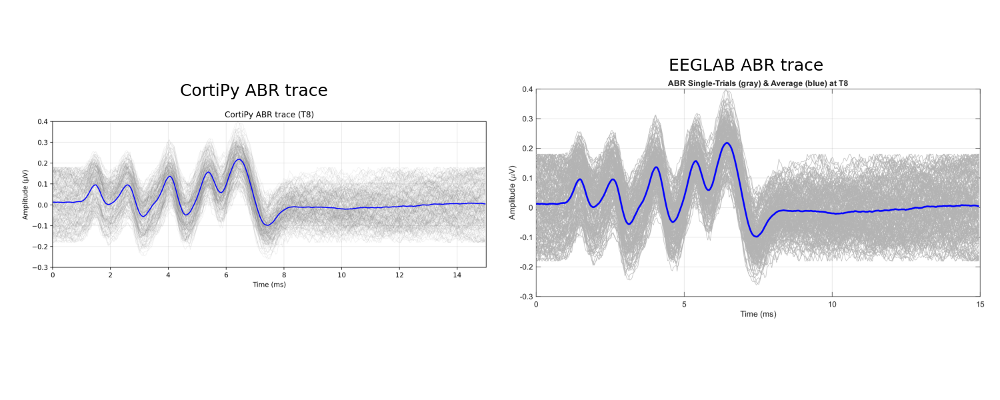
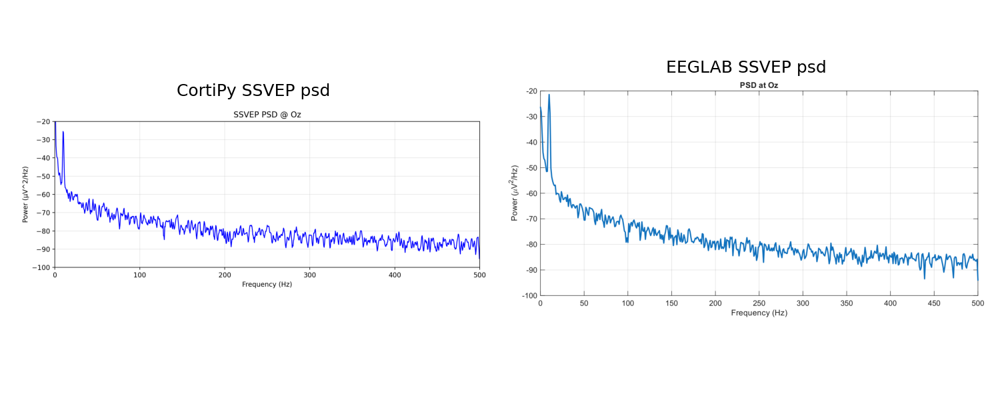

# run_experiment1.py

Back to [experiments overview](../README.md).

## Purpose
Experiment 1 focuses on streaming and numerical validation. It validates BIN I/O integrity, runs a synthetic pipeline surrogate, and generates CortiPy plots to compare against EEGLAB reference figures for multiple paradigms.

## Inputs and data sources
- Synthetic BIN datasets under `experiments/synData/`:
  - ABR, ASSR, Oddball, VEP, SSVEP, ContinuousSine
- EEGLAB reference PDFs in the same folders (copied into results for comparison).
- No external datasets required.

## What the script does
1. **Bitwise identity check**
   - Loads a sample BIN dataset using `ExperimentBinLoader`.
   - Re-exports it to BIN and compares SHA256 hashes to confirm byte-for-byte parity.
2. **Pipeline equivalence surrogate**
   - Uses `CortiDataset.synthetic_sine_trigger()` to synthesize a sine + trigger stream.
   - Epochs on triggers, computes ERP and PSD, and saves reference plots.
3. **Manual placeholders**
   - Writes notes for hardware-dependent steps (live acquisition, topography comparison).
4. **Dataset plot generation**
   - Loads each synthetic dataset in `synData`.
   - Applies a standard montage and uses CortiPy evaluators to produce traces/topomaps/PSDs.
   - Copies EEGLAB PDFs into results and generates side-by-side image comparisons.
5. Writes a JSON summary into `results_exp1/`.

## Outputs and plots
Written under `experiments/format_benchmark/results_exp1/`:
- `bitwise_identity/` with hash report.
- `pipeline_equivalence/` plots: `evoked_cortipy.png` and `psd_cortipy.png` (and PDFs).
- `cortipy_plots/` with evaluator-generated images for each dataset.
- `eeglab_refs/` with copied EEGLAB reference PDFs/PNGs.
- Side-by-side comparison images for each dataset and plot type.
- `experiment1_results.json` with structured results and metadata.

## Example outputs (current results)





## How to run
```bash
PYTHONPATH=. python experiments/format_benchmark/run_experiment1.py
```

## Related experiments
- [run_experiment1_V2](README_run_experiment1_V2.md) is a variant with different plotting and styling.
- [compare_sine_bins](../README_compare_sine_bins.md) numerically compares EEGLAB vs CortiPy BINs.
