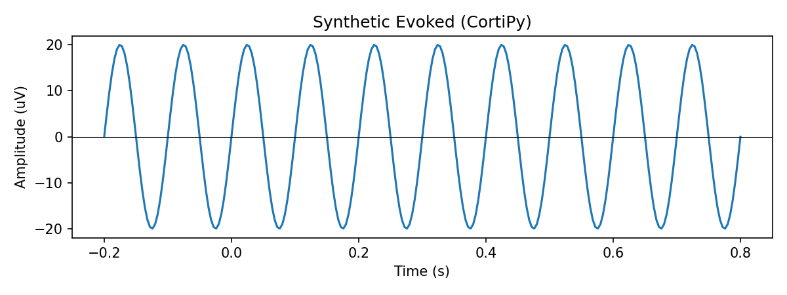
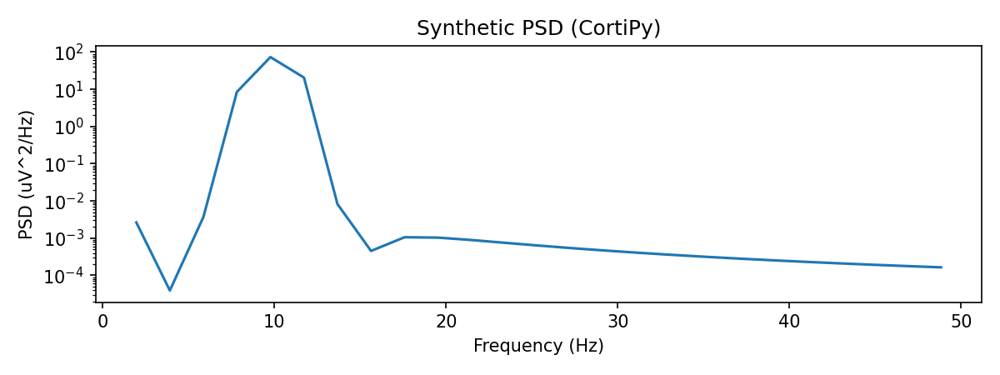
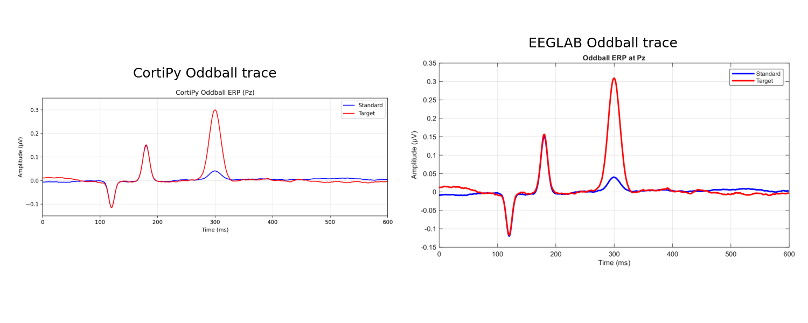
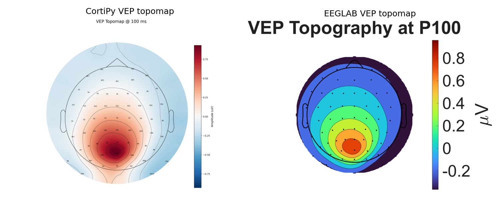

# run_experiment1_V2.py

Back to [experiments overview](../README.md).

## Purpose
A variant of Experiment 1 with alternative plotting logic and styling. It runs the same validation steps but uses a different plotting pipeline and more elaborate trace/topomap construction for parity with EEGLAB figures.

## Inputs and data sources
- Synthetic BIN datasets under `experiments/synData/`:
  - ABR, ASSR, Oddball, VEP, SSVEP, ContinuousSine
- EEGLAB reference PDFs in the same folders.

## What the script does
1. **Bitwise identity check** (same as Experiment 1)
   - Re-exports a BIN dataset and compares SHA256 hashes.
2. **Pipeline equivalence surrogate**
   - Builds a synthetic sine + trigger stream and plots ERP/PSD outputs.
3. **Manual placeholders**
   - Writes notes for hardware-dependent steps and topography comparisons.
4. **Dataset plots (custom logic)**
   - Loads each dataset and applies standard montage.
   - Generates specific traces and topomaps per paradigm with ad-hoc logic to mimic EEGLAB conventions (for example, ABR 0-15 ms windows, Oddball target/standard separation heuristics).
5. Copies EEGLAB references and generates side-by-side visual comparisons.
6. Writes a JSON summary to `results_exp1/`.

## Outputs and plots
Written under `experiments/format_benchmark/results_exp1/`:
- `pipeline_equivalence/` plots.
- `cortipy_plots/` and ad-hoc PDF/PNG figures for each dataset.
- `eeglab_refs/` and side-by-side comparisons.
- `experiment1_results.json`.

## Example outputs (current results)





## How to run
```bash
PYTHONPATH=. python experiments/format_benchmark/run_experiment1_V2.py
```

## Related experiments
- [run_experiment1](README_run_experiment1.md) is the baseline Experiment 1 implementation.
- [plot_eeglab_sine_bins](../README_plot_eeglab_sine_bins.md) visualizes EEGLAB reference BINs.
