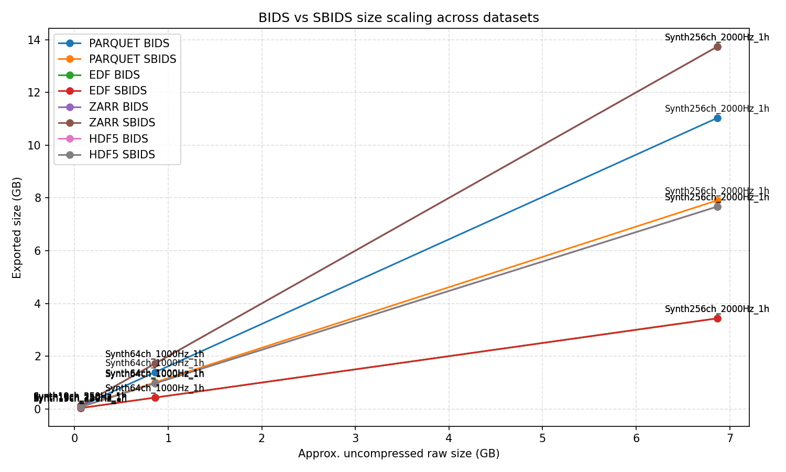
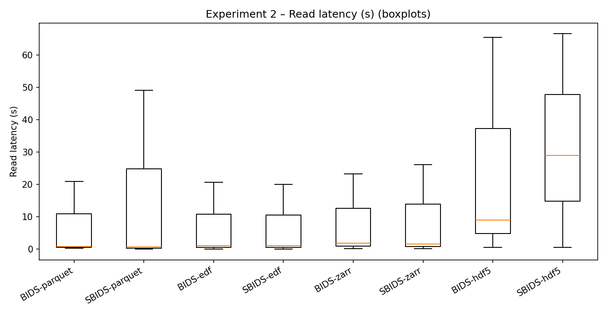
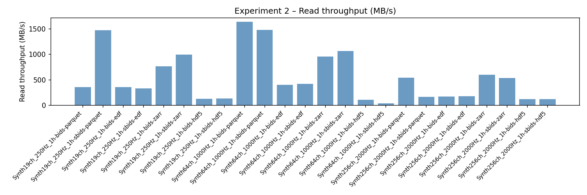

# run_experiment2.py

Back to [experiments overview](../README.md).

## Purpose
Experiment 2 benchmarks file format storage and latency. It generates synthetic datasets, exports them to BIDS or SBIDS in multiple formats, then measures file sizes and read/write latency with CPU and memory usage.

## Inputs and data sources
- Synthetic datasets created on the fly via `CortiDataset.from_synthetic`:
  - 19 channels @ 250 Hz, 1 hour
  - 64 channels @ 1000 Hz, 1 hour
  - 256 channels @ 2000 Hz, 1 hour
- No external datasets required.

## What the script does
1. Generates or selects synthetic datasets.
2. For each dataset, container, and format combination:
   - Exports to BIDS (`ds.to_bids`) or SBIDS (`ds.to_sbids`).
   - Measures write time, CPU time, and RSS peak.
   - Reloads the exported data and measures read time, CPU time, and RSS peak.
   - Records output size and throughput (bytes/second).
3. Optionally deletes artifacts to save disk space.
4. Writes results to JSON and generates a rich set of plots (size, latency, throughput, speedups, heatmaps, etc.).
5. Supports `--plots-only` to regenerate plots from an existing results JSON.

## Outputs and plots
Written under `experiments/format_benchmark/results_exp2/`:
- `experiment2_results.json` with all metrics.
- Multiple PNG/PDF plots, including:
  - latency boxplots and read/write comparisons
  - size vs format trends
  - throughput, speedup, and correlation charts
  - failure summaries and efficiency plots

## Example outputs (current results)




## How to run
```bash
PYTHONPATH=. python experiments/format_benchmark/run_experiment2.py
PYTHONPATH=. python experiments/format_benchmark/run_experiment2.py --containers bids --formats edf
PYTHONPATH=. python experiments/format_benchmark/run_experiment2.py --plots-only --results-json experiments/format_benchmark/results_exp2/experiment2_results.json
```

## Related experiments
- [run_experiment3](README_run_experiment3.md) measures streaming access patterns on the exported data.
- [bids_performance](../README_bids_performance.md) benchmarks BIDS loading on real datasets.
- [sbids_performance](../README_sbids_performance.md) benchmarks SBIDS loading on real datasets.
