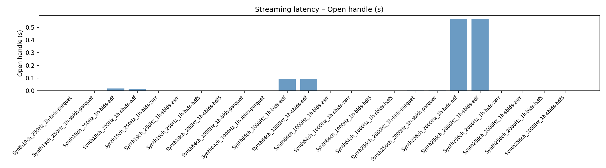
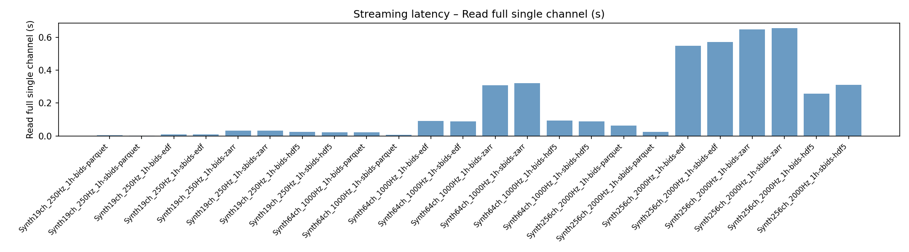
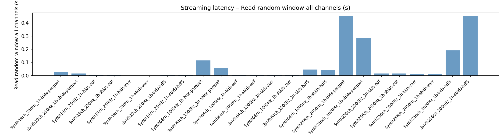
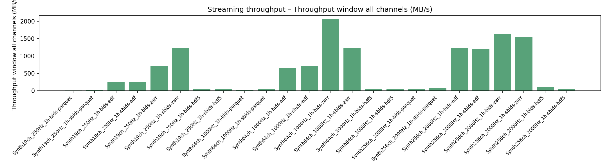

# run_experiment3.py

Back to [experiments overview](../README.md).

## Purpose
Experiment 3 benchmarks streaming-style access. It evaluates how fast different formats allow partial reads without preloading the full recording.

## Inputs and data sources
- Synthetic datasets created on the fly via `CortiDataset.from_synthetic` (same sizes as Experiment 2).
- Exported into BIDS and SBIDS containers for multiple formats (parquet, edf, zarr, hdf5).

## What the script does
1. Generates or selects synthetic datasets.
2. Exports each dataset to BIDS and SBIDS in the chosen formats.
3. Opens each exported file in streaming mode and measures:
   - Open time (no preload).
   - Full read of a single channel.
   - Random window read (default 10 s) of a single channel.
   - Random window read of all channels.
4. Collects wall time, CPU time, and RSS peak (when `psutil` is available).
5. Writes results to JSON and emits summary plots.
6. Supports `--plots-only` to render plots from existing results.

## Outputs and plots
Written under `experiments/format_benchmark/results_exp3/`:
- `experiment3_results.json` with streaming metrics.
- Multiple PNG/PDF plots (open time, read window times, and size/throughput summaries).

## Example outputs (current results)





## How to run
```bash
PYTHONPATH=. python experiments/format_benchmark/run_experiment3.py
PYTHONPATH=. python experiments/format_benchmark/run_experiment3.py --formats edf --window-s 5
PYTHONPATH=. python experiments/format_benchmark/run_experiment3.py --plots-only --results-json experiments/format_benchmark/results_exp3/experiment3_results.json
```

## Related experiments
- [run_experiment2](README_run_experiment2.md) benchmarks full read/write latency and storage size.
